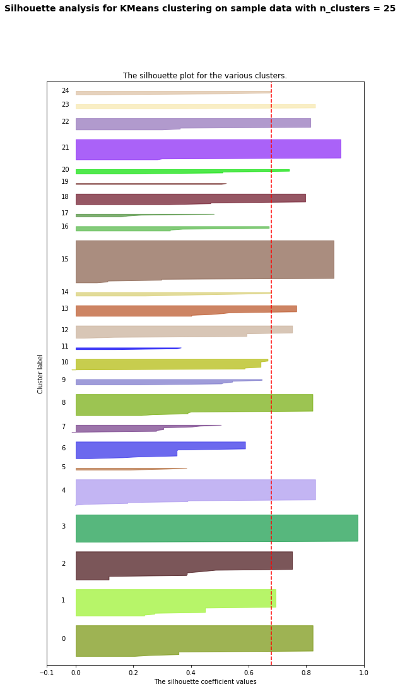

# ML Assignment 3, Option 2, Iteration 1

## Chosen features

I wanted to try clustering the images by some of the characteristics of the artwork. I specifically was interested in art movement and medium as ways of grouping, so I started with those two as features. From there, I delved further into other visual features like whether it had text, reflection, kinetic movement, and spatial dimension. Lastly, I tried experimenting with country of origin to see if artwork had similarities there.

### Feature transformation

I first wanted to check the various data types of each of the columns in the table, to see what needed to be transformed. I noticed that some of the columns (has_text, reflection, kinetic, spatial_dimension) were already Booleans, so I left those in as is.

I then wanted to convert each of the other features from strings to integers. First, I ensured that they were all being read as strings by converting each desired feature to a string. Then, because I was primarily interested in categorizing them as is, I used LabelEncoder to assign a number to each value, across each column. I used this method to transform art_movement, primary_medium, and country_of_origin.

Note: I ended up leaving out country_of_origin from my final table because the model performed better without it.

## Cluster choices

I left the range as is so that I could compare clusters of 5 vs 25. In my final result, I picked 20 clusters because the average silhouette score was highest, and the silhouette images appeared to be square.

